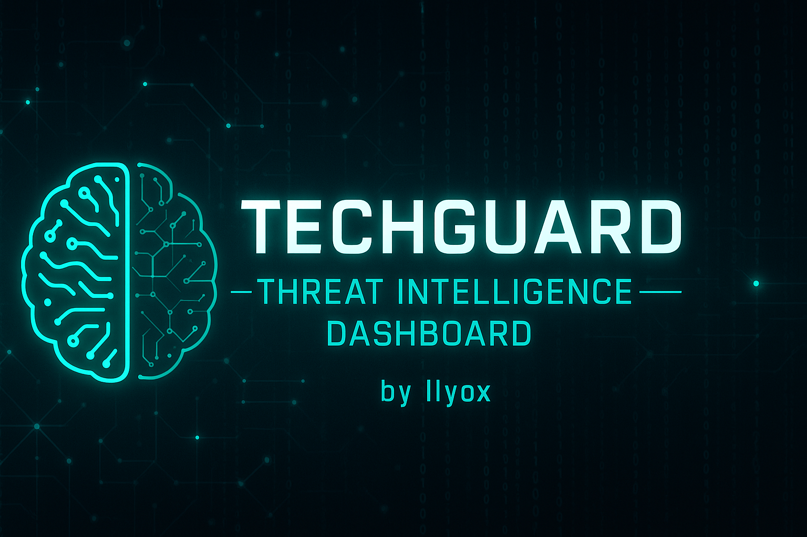

LA V2 de TECHGUARD , renomée CyberSec Watch V2 est disponible sur https://github.com/ilyoxxx/CyberSec-Watch-v2

## Authors

- [@ilyox.fr](https//github.com/ilyoxxx)

# 🧠 TechGuard – Threat Intelligence Dashboard

**TechGuard** est une application web de **veille en cybersécurité**.  
Elle permet d’analyser, rechercher et visualiser les dernières vulnérabilités (CVE) publiées dans le monde via l’API officielle de la [National Vulnerability Database (NVD)](https://nvd.nist.gov/).  

Ce projet a pour but de fournir un outil de **Threat Intelligence** simple, moderne et utile pour les étudiants, administrateurs et passionnés de cybersécurité.

---

## 🚀 Fonctionnalités principales

✅ Affiche les **dernières failles CVE** (issues de l’API NVD 2.0)  
✅ **Recherche dynamique** par mot-clé (ex: `Windows`, `Cisco`, `Apache`)  
✅ **Classement automatique par gravité (CVSS)** avec code couleur :
- 🟢 Faible  
- 🔵 Moyen  
- 🟠 Élevé  
- 🔴 Critique  

✅ **Graphique dynamique sur les dernières 24 heures** (CVE publiées récemment)  
✅ Interface **moderne, responsive et sombre** (Bootstrap + Chart.js)  
✅ Backend Node.js + Express + Fetch natif  
✅ Facile à héberger (Render, Replit, VPS, etc.)

---
## 🧩 Technologies utilisées  

| Catégorie | Technologie |
|------------|--------------|
| Backend | Node.js + Express |
| Frontend | HTML5, CSS3, Bootstrap |
| API | [NVD CVE API v2.0](https://services.nvd.nist.gov/rest/json/cves/2.0) |
| Autres | dotenv, fetch |

---

## ⚙️ Installation et exécution  

### 1. Cloner le dépôt  
```bash
git clone https://github.com/<ton-pseudo>/TechGuard.git
cd TechGuard
```
### 2. Installer les dépendances
```bash
npm install
```
### 3. Créer un fichier .env
```bash
PORT=3000
```
### 4️. Lancer l’application
```bash
npm start
```
Puis ouvre ton navigateur sur 👉 http://localhost:3000
--
# 🧠 Aperçu du projet
🔍 *Interface principale*

- Barre de recherche (mot-clé CVE)

- Liste de vulnérabilités avec leur identifiant, description et score CVSS

- Graphique dynamique (CVE publiées sur les dernières 24h)

📊 **Fonctionnalités graphiques**

- Ligne temporelle des CVE récentes

**(Prochainement) Histogramme par gravité (faible, moyenne, élevée, critique)**
### 🧠 Objectif du projet

> Fournir un outil de veille technologique en cybersécurité pour identifier les menaces > > récentes, suivre les failles critiques et améliorer la réactivité des équipes >
>informatiques.

**Ce dashboard est particulièrement adapté pour :**

- Les étudiants BTS SIO / SISR 🧑‍💻

- Les administrateurs réseaux 🔧

- Les passionnés de cybersécurité 🔒

- Toute personne souhaitant faire de la Threat Intelligence simple et efficace.
### 🧱 Structure du projet
```bash
TechGuard/
├── server.js          # Backend Express + API NVD
├── public/
│   ├── index.html     # Interface web (Dashboard)
│   ├── style.css      # Thème et design
│   └── script.js      # (Optionnel) JS séparé
├── package.json
└── .env
```

## 🪪 License

This project is licensed under the **Creative Commons Attribution – NonCommercial – NoDerivatives 4.0 International** license.

That means you **must credit the author (Ilyox)** if you share it,  
you **cannot use it for commercial purposes**,  
and you **cannot modify or redistribute** it.

🔗 [View full license → CC BY-NC-ND 4.0](https://creativecommons.org/licenses/by-nc-nd/4.0/)

## Screenshots


## Support

Support mail : contact@ilyox.fr
ou serveur discord : https://discord.gg/DKNYmxbCCd

[](https://creativecommons.org/licenses/by-nc-nd/4.0/)
